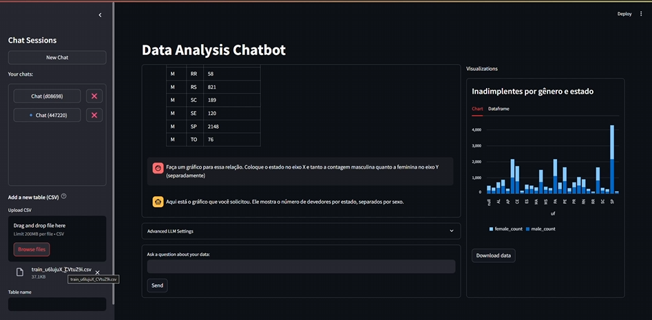
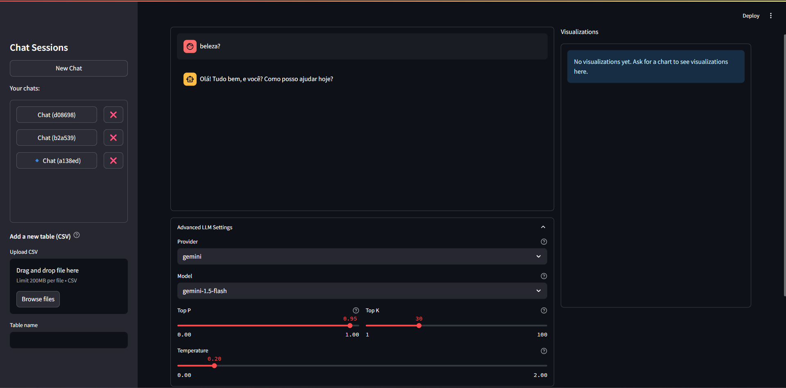

# Data-Analytics-Chatbot-with-LLMs
This repository contains implementations for a data analytics chatbot with LLMs. The chatbot is able to interpret queries made in natural language to a dataset, translate them into appropriate operations on a cloud-based database, and return meaningful insights from a given dataset.






Here is a video demo of the application in action, it shows a brief overview of the features and functionalities of the chatbot and explains the repository structure [PT-BR]:

[Watch the demo video on Google Drive](https://drive.google.com/file/d/1sVwMaYjG0K-erpBoN5SanHFnXuBb3nQg/view?usp=sharing)

> This video is currently outdated, as it was recorded before the latest major changes were made to the repository. However, it still provides a good overview of the project and its functionalities. I plan to update the video in the future to reflect the latest changes and improvements made to the project.

## Architecture Overview
This repo is divided into three main parts: the frontend, the backend and the cloud. The frontend is responsible for the user interface, while the backend handles the logic of processing user queries, interacting with the database, and generating responses. The cloud part is responsible for creatng the infrascructure and hosting the database and making it accessible to the backend.

```bash
Data-Analytics-Chatbot-with-LLMs/
├── backend/
│   └── app/
│       ├── main.py
│       ├── ... (other backend files)
│       └── llm/
│           ├── factory.py
│           ├── prompt_templates.py
│           └── providers/
│               ├── base.py
│               └── ... (other LLM providers)
├── cloud/
│   ├── create_database.py
│   └── set_default_table.py
├── frontend/
│   ├── app.py
│   ├── modules/
│   │   ├── api.py
│   │   └── ... (other system modules)
│   ├── ui/
│   │   ├── landing_page.py
│   │   └── ... (other UI components)
│   └── assets/
│       ├── landing_page_print.png
│       └── ... (other asset files)
├── .env
├── requirements.txt
├── run.py
└── README.md
```

As everything was made using Python, I could have avoided this division between front and backend, but I wanted to create a more modular and scalable architecture, similar to real-world web applications. This way, the frontend can be easily replaced or updated without affecting the backend logic, and vice versa.

For the frontend, I used [Streamlit](https://streamlit.io/), a powerful framework for building data applications. The backend is built with Python (FastAPI), using libraries such as [SQLAlchemy](https://www.sqlalchemy.org/) for database interactions. The cloud part is implemented using [AWS RDS](https://aws.amazon.com/rds/) for hosting the database, and [Boto3](https://boto3.amazonaws.com/v1/documentation/api/latest/index.html) for interacting with AWS services.

The main LLM provider used in this project is [Google Gemini](https://ai.google.dev/gemini), which provides powerful language models that can understand and generate natural language text. The models are used to interpret user queries, translate them into SQL queries, and generate responses based on the results of the queries. Gemini was chosen because it seamlessly integrates with Python functions and have a robust API for interacting with the backend.

Along with the main LLM provider, I also implemented a factory pattern to allow for easy integration of other LLM providers in the future. This way, the chatbot can be easily extended to support multiple LLM providers without changing the core logic of the application. As an example, I added another provider, [Groq](https://groq.com/), by just creating a new file in the `llm/providers/`.

## Installation and Setup
To run the application locally, you only need to create a `.env` file in the root directory or export the following environment variables in your terminal and create a virtual environment with the required dependencies:

```bash
python -m venv .venv
source .venv/bin/activate  # On Windows use: .venv\Scripts\activate
pip install -r requirements.txt
```

For your env file, you need to add the following environment variables:
```plaintext
GEMINI_API_KEY=your_gemini_api_key
```

Incase you already have a cloud database instantiated, you can add the following environment variable directply to the `.env` file:

```plaintext
DATABASE_URL=your_database_url
```

If you want to create a new AWS RDS cloud database, you need add you credencials to the `.env` file:

```plaintext
AWS_ACCESS_KEY_ID=your_aws_access_key_id
AWS_SECRET_ACCESS_KEY=your_aws_secret_access_key
AWS_REGION_NAME=your_aws_region

DB_NAME=your_database_name
DB_INSTANCE_IDENTIFIER=your_database_instance_identifier
DB_USERNAME=your_database_master_username
DB_PASSWORD=your_database_master_password
```

Create a new database by running the following command in the terminal:

```bash
python run.py --create
```
A new AWS RDS database will be created, and the `DATABASE_URL` will be automatically updated in the `.env` file.

Without a cloud database or AWS credencials, the code will automatically use a local SQLite database.

With all set, you can run the application via:
```bash
python run.py
```

## Comments and Thoughts
Biggest difficulties:
- Organizing the code in a way that is easy to understand and maintain.
- Ensuring that the chatbot can call the right functions with the right parameters based on the user's query, especially when dealing with different LLM providers and their specific requirements.
- Making the conversation context persistent across multiple queries and multiple models, so that any chatbot can provide meaningful responses based on the user's previous queries and continue the conversation seamlessly.
- By far, the most challenging part was running all the code together from a single entry point, as the code is divided into multiple files and modules. I had to ensure that all the imports and dependencies were correctly set up, and that the code could be executed in a single run without any issues.

---
Future improvements:
- The model does no work so well on newly uploaded datasets, probably because it has no backgroud information about its columns. It would be great to have a way to provide the model with some context about the dataset.
- There is no logic for multiple users, login, or authentication.
- Some details like chat naming and user profile are not implemented.
- The interface look well using streamlit, but it would be great to have a more polished and customizable UI.
- A stronger error handling and validation in backend. I did not go deep into documentation of the libraries used, so there may be some edge cases that are not handled the best way.
- Using a prper cloud infrastructure as code tool like Terraform or AWS CDK to manage the cloud resources.
- Display in a better way the thinking process of the models that support it, especially Deepseek R1, that usually thinks a lot before answering.

> You may notice that some commits were made after I turned in the assignment (07/06/2025). However, since the submission deadline was 09/06/2025, I took the liberty of continuing to improve the project.