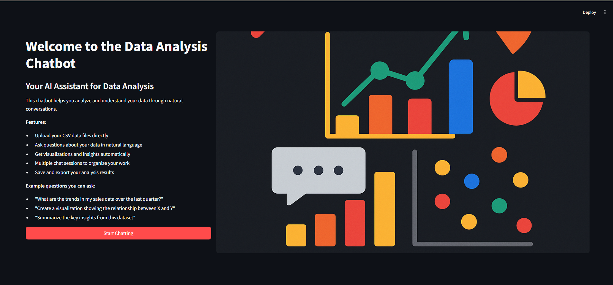

# Data-Analytics-Chatbot-with-LLMs
This repository contains implementations for a data analytics chatbot with LLMs. The chatbot is able to interpret queries made in natural language to a dataset, translate them into appropriate operations on a cloud-based database, and return meaningful insights from a given dataset.



---
To run the application locally, you only need to create a `.env` file in the root directory or export the following environment variables in your terminal and create a virtual environment with the required dependencies:

```bash
python -m venv .venv
source .venv/bin/activate  # On Windows use: .venv\Scripts\activate
pip install -r requirements.txt
```

For your env file, you need to add the following environment variables:
```plaintext
GEMINI_API_KEY=your_gemini_api_key
```

Incase you already have a cloud database instantiated, you can add the following environment variable directply to the `.env` file:

```plaintext
DATABASE_URL=your_database_url
```

If you want to create a new AWS RDS cloud database, you need add you credencials to the `.env` file:

```plaintext
AWS_ACCESS_KEY_ID=your_aws_access_key_id
AWS_SECRET_ACCESS_KEY=your_aws_secret_access_key
AWS_REGION_NAME=your_aws_region

DB_NAME=your_database_name
DB_INSTANCE_IDENTIFIER=your_database_instance_identifier
DB_USERNAME=your_database_master_username
DB_PASSWORD=your_database_master_password
```

Create a new database by running the following command in the terminal:

```bash
python run.py --create
```
A new AWS RDS database will be created, and the `DATABASE_URL` will be automatically updated in the `.env` file.

Without a cloud database or AWS credencials, the code will automatically use a local SQLite database.

---
With all set, you can run the application via:
```bash
python run.py
```

---
Biggest difficulties:
- Organizing the code in a way that is easy to understand and maintain.
- Ensuring that the chatbot can call the right functions with the right parameters based on the user's query.
- By far, the most challenging part was to create the possibility of creating a new cloud database from scratch without much prior knowledge about AWS.

---
Future improvements:
- The model does no work so well on new uploaded datasets, probably because it has no backgroud information about its columns. It would be great to have a way to provide the model with some context about the dataset.
- There is no logic for multiple users, login, or authentication.
- Some details like chat naming and user profile are not implemented.
- The interface look well using streamlit, but it would be great to have a more polished and customizable UI.
- A stronger error handling and validation in backend. I did not go deep into documentation of the libraries used, so there may be some edge cases that are not handled the best way.